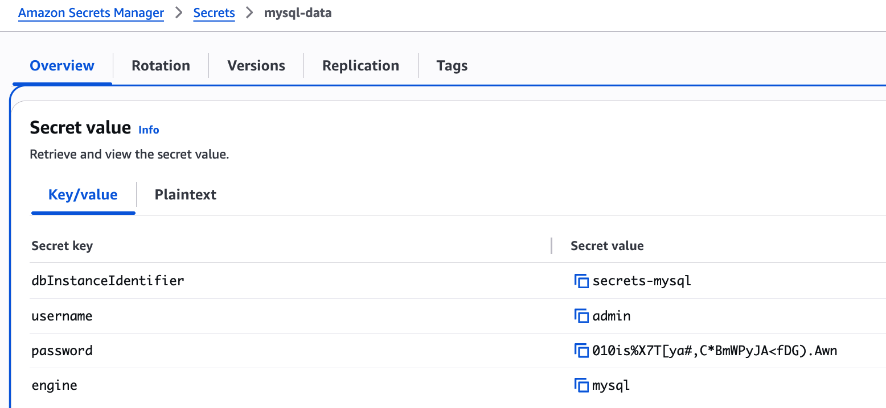
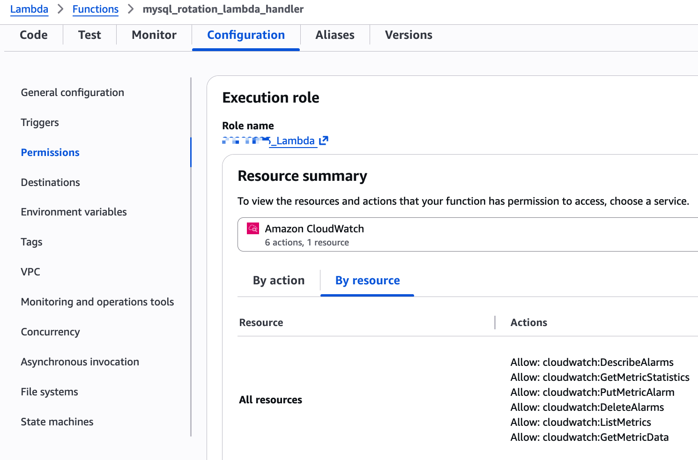
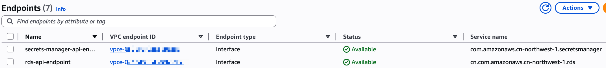
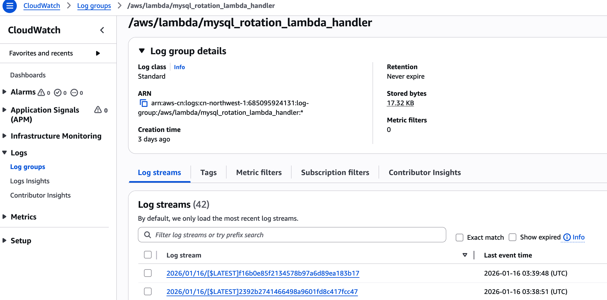

# RDS密码自动轮换方案

基于AWS Secrets Manager和Lambda实现的RDS数据库密码自动轮换解决方案，支持MySQL、PostgreSQL和Oracle等多种数据库引擎。

## 方案概述

本方案为100+台RDS实例实现自动化密码轮换，通过Secrets Manager管理密码版本，使用Lambda函数执行轮换逻辑，确保数据库访问凭证的安全性和合规性。

### 核心特性

- 支持MySQL、PostgreSQL、Oracle三种数据库引擎
- 使用RDS API修改密码，无需数据库连接
- 每个RDS实例独立管理，互不影响
- 自动轮换计划（30/60/90天可配置）
- 完整的错误处理和CloudWatch监控
- 使用VPC Endpoint降低成本

## 架构设计

### 整体架构

```
┌─────────────────────────────────────────────────────────────────────────────┐
│                          AWS Secrets Manager                                │
│                                                                             │
│  MySQL Secrets          PostgreSQL Secrets        Oracle Secrets           │
│  ┌──────────────┐       ┌──────────────┐         ┌──────────────┐         │
│  │Secret-MySQL-1│       │Secret-PG-1   │         │Secret-Oracle-1│        │
│  │(30天轮换)     │       │(30天轮换)     │         │(30天轮换)     │        │
│  └──────┬───────┘       └──────┬───────┘         └──────┬────────┘        │
│  ┌──────────────┐       ┌──────────────┐         ┌──────────────┐         │
│  │Secret-MySQL-2│       │Secret-PG-2   │         │Secret-Oracle-2│        │
│  └──────┬───────┘       └──────┬───────┘         └──────┬────────┘        │
│    ... (50个)              ... (30个)               ... (20个)            │
└─────────┼──────────────────────┼──────────────────────────┼───────────────┘
          │                      │                          │
          ↓                      ↓                          ↓
   ┌─────────────┐        ┌─────────────┐          ┌─────────────┐
   │   MySQL     │        │ PostgreSQL  │          │   Oracle    │
   │  Rotation   │        │  Rotation   │          │  Rotation   │
   │   Lambda    │        │   Lambda    │          │   Lambda    │
   └──────┬──────┘        └──────┬──────┘          └──────┬──────┘
          │                      │                          │
          └──────────────────────┼──────────────────────────┘
                                 ↓
                    ┌────────────────────────┐
                    │   RDS API              │
                    │   (VPC Endpoint)       │
                    │   ModifyDBInstance     │
                    │   DescribeDBInstances  │
                    └────────────┬───────────┘
                                 ↓
        ┌────────────────────────┼────────────────────────┐
        │                        │                        │
        ↓                        ↓                        ↓
┌───────────────┐        ┌───────────────┐       ┌───────────────┐
│ RDS MySQL     │        │ RDS PostgreSQL│       │ RDS Oracle    │
│ Instances     │        │ Instances     │       │ Instances     │
│ (50个)        │        │ (30个)        │       │ (20个)        │
│               │        │               │       │               │
│ - mysql-rds-1 │        │ - pg-rds-1    │       │ - oracle-rds-1│
│ - mysql-rds-2 │        │ - pg-rds-2    │       │ - oracle-rds-2│
│ - ...         │        │ - ...         │       │ - ...         │
└───────────────┘        └───────────────┘       └───────────────┘
```

### 关键设计决策

| 决策点 | 选择 | 原因 |
|--------|------|------|
| **密码修改方式** | RDS API | 无需数据库连接，简化实现，统一接口 |
| **Lambda组织方式** | 每种数据库引擎一个Lambda | 独立维护，故障隔离，支持引擎特定优化 |
| **Secret颗粒度** | 1种RDS = 1个Secret | 独立轮换，互不影响，精细化管理 |
| **网络架构** | VPC Endpoint | 降低NAT网关成本，提高安全性 |

| 特性对比 | 方法1: RDS API方式 | 方法2: pymysql直连方式|
|---------|------------------|---------------------|
| 修改密码方式 | 调用AWS RDS API | 直接连接数据库执行SQL |
| 核心代码 | rds_client.modify_db_instance() | pymysql.connect() + ALTER USER |
| 修改的密码 | RDS Master User密码 | 任意数据库用户密码 |
| 网络连接 | 访问AWS服务API（公网） | 访问RDS数据库（VPC内网） |
| Lambda位置 | 可在VPC内或VPC外 | 必须在VPC内 |
| VPC Endpoint需求 | 需要RDS API endpoint<br> 需要Secrets Manager endpoint | 只需要Secrets Manager endpoint |
| NAT Gateway需求 | 如果不用endpoint，需要NAT | 如果不用endpoint，需要NAT |
| 外部依赖 | 无（boto3内置） | 需要pymysql Layer |
| 安全组配置 | Lambda出站：HTTPS(443) | Lambda出站：MySQL(3306) |
| RDS状态等待 | 需要等待RDS变为available | 立即生效，无需等待 |
| 执行时间 | 较长（需等待RDS修改完成） | 较快（直接执行SQL） |
| 适用场景 | 修改RDS主用户密码 | 修改应用数据库用户密码 |
| 多用户支持 | 只能修改Master User | 可以修改任意用户 |

## 组件说明

### 1. Secrets Manager配置

每个RDS实例对应一个Secret，存储以下信息：

```json
{
  "dbInstanceIdentifier": "my-mysql-instance",
  "username": "admin",
  "password": "current-password",
  "engine": "mysql",
  "host": "my-mysql-instance.abc123.us-east-1.rds.amazonaws.com",
  "port": 3306,
  "dbname": "mydb"
}
```

**必需字段：**
- `dbInstanceIdentifier`: RDS实例标识符
- `username`: 数据库主用户名
- `password`: 当前密码
- `engine`: 数据库引擎类型（mysql/postgres/oracle）

**可选字段：**
- `host`: RDS endpoint地址
- `port`: 数据库端口
- `dbname`: 默认数据库名

### 2. Lambda函数

#### MySQL Rotation Lambda
- **文件**: `mysql_rotation_lambda_handler.py`
- **运行时**: Python 3.x
- **内存**: 256 MB
- **超时**: 300秒
- **VPC**: 与RDS相同VPC
- **环境变量**:
  - `PASSWORD_LENGTH`: 密码长度（默认32）
  - `EXCLUDE_CHARACTERS`: 排除字符（默认`:/@"'\`）

#### PostgreSQL Rotation Lambda
- 待实现（结构类似MySQL）

#### Oracle Rotation Lambda
- 待实现（结构类似MySQL）

### 3. IAM权限

Lambda执行角色需要以下权限：

```json
{
  "Version": "2012-10-17",
  "Statement": [
    {
      "Effect": "Allow",
      "Action": [
        "secretsmanager:DescribeSecret",
        "secretsmanager:GetSecretValue",
        "secretsmanager:PutSecretValue",
        "secretsmanager:UpdateSecretVersionStage"
      ],
      "Resource": "arn:aws:secretsmanager:region:account:secret:*"
    },
    {
      "Effect": "Allow",
      "Action": [
        "secretsmanager:GetRandomPassword"
      ],
      "Resource": "*"
    },
    {
      "Effect": "Allow",
      "Action": [
        "rds:ModifyDBInstance",
        "rds:DescribeDBInstances"
      ],
      "Resource": "arn:aws-cn:rds:region:account:db:*"
    },
    {
      "Effect": "Allow",
      "Action": [
        "logs:CreateLogGroup",
        "logs:CreateLogStream",
        "logs:PutLogEvents"
      ],
      "Resource": "arn:aws-cn:logs:*:*:*"
    }
  ]
}
```

### 4. VPC Endpoint配置

**必需的VPC Endpoint：**

1. **Secrets Manager Endpoint**
   - 服务名称: `com.amazonaws.region.secretsmanager`
   - 类型: Interface
   - 启用私有DNS

2. **RDS Endpoint**
   - 服务名称: `com.amazonaws.region.rds`
   - 类型: Interface
   - 启用私有DNS

**Lambda代码中的配置：**
```python
rds_client = boto3.client(
    'rds',
    endpoint_url='https://vpce-xxxxx.rds.region.vpce.amazonaws.com.cn'
)
```

## 部署步骤

### 步骤1: 创建VPC Endpoint

```bash
# 创建Secrets Manager VPC Endpoint
aws ec2 create-vpc-endpoint \
  --vpc-id vpc-xxxxx \
  --service-name com.amazonaws.cn-northwest-1.secretsmanager \
  --vpc-endpoint-type Interface \
  --subnet-ids subnet-xxxxx subnet-yyyyy \
  --security-group-ids sg-xxxxx

# 创建RDS VPC Endpoint
aws ec2 create-vpc-endpoint \
  --vpc-id vpc-xxxxx \
  --service-name com.amazonaws.cn-northwest-1.rds \
  --vpc-endpoint-type Interface \
  --subnet-ids subnet-xxxxx subnet-yyyyy \
  --security-group-ids sg-xxxxx
```

### 步骤2: 部署Lambda函数

```bash
# 打包Lambda代码
zip mysql-rotation-lambda.zip mysql_rotation_lambda_handler.py

# 创建Lambda函数
aws lambda create-function \
  --function-name mysql-rotation-lambda \
  --runtime python3.9 \
  --role arn:aws-cn:iam::account:role/lambda-rotation-role \
  --handler mysql_rotation_lambda_handler.lambda_handler \
  --zip-file fileb://mysql-rotation-lambda.zip \
  --timeout 300 \
  --memory-size 256 \
  --vpc-config SubnetIds=subnet-xxxxx,subnet-yyyyy,SecurityGroupIds=sg-xxxxx \
  --environment Variables="{PASSWORD_LENGTH=32,EXCLUDE_CHARACTERS=':/@\"\\'\\\\'}"
```

### 步骤3: 批量创建Secrets

使用脚本批量创建Secret（示例）：

```python
import boto3
import json

secrets_client = boto3.client('secretsmanager')

# RDS实例列表
rds_instances = [
    {'dbInstanceIdentifier': 'mysql-rds-1', 'username': 'admin', 'engine': 'mysql'},
    {'dbInstanceIdentifier': 'mysql-rds-2', 'username': 'admin', 'engine': 'mysql'},
    # ... 更多实例
]

for rds in rds_instances:
    secret_value = {
        'dbInstanceIdentifier': rds['id'],
        'username': rds['username'],
        'password': 'initial-password',  # 初始密码
        'engine': rds['engine']
    }
    
    # 创建Secret
    response = secrets_client.create_secret(
        Name=f"rds/{rds['engine']}/{rds['id']}",
        SecretString=json.dumps(secret_value),
        Tags=[
            {'Key': 'Engine', 'Value': rds['engine']},
            {'Key': 'Environment', 'Value': 'production'}
        ]
    )
    
    # 配置自动轮换
    secrets_client.rotate_secret(
        SecretId=response['ARN'],
        RotationLambdaARN='arn:aws-cn:lambda:region:account:function:mysql-rotation-lambda',
        RotationRules={'AutomaticallyAfterDays': 30}
    )
    
    print(f"Created and configured secret for {rds['id']}")
```

### 步骤4: 配置CloudWatch告警

```bash
# Lambda执行失败告警
aws cloudwatch put-metric-alarm \
  --alarm-name mysql-rotation-lambda-errors \
  --alarm-description "Alert when rotation lambda fails" \
  --metric-name Errors \
  --namespace AWS/Lambda \
  --statistic Sum \
  --period 300 \
  --threshold 1 \
  --comparison-operator GreaterThanThreshold \
  --dimensions Name=FunctionName,Value=mysql-rotation-lambda \
  --evaluation-periods 1 \
  --alarm-actions arn:aws-cn:sns:region:account:alert-topic
```

## 密码轮换流程

Lambda函数实现标准的四步轮换流程：

### 1. createSecret
- 生成新的随机密码
- 将新密码存储为AWSPENDING版本
- 调用RDS API更新数据库master password

### 2. setSecret
- 等待RDS实例变为available状态
- 使用RDS Waiter机制（最多等待10分钟）

### 3. testSecret
- 验证RDS实例状态
- 确认数据库可用

### 4. finishSecret
- 将AWSPENDING版本标记为AWSCURRENT
- 完成轮换流程

## 监控和日志

### CloudWatch Logs

Lambda函数输出详细日志：
- 轮换开始/结束时间
- 每个步骤的执行状态
- RDS实例状态变化
- 错误信息和堆栈跟踪

### 关键指标

- Lambda调用次数
- Lambda执行时长
- Lambda错误率
- RDS实例状态变化

## 注意事项

### 安全性

1. **尽量不要在日志中输出明文密码**
   - 生产环境需删除代码中的密码打印语句
   
2. **使用KMS加密**
   - Secrets Manager默认使用AWS托管密钥
   - 可配置自定义KMS密钥

3. **最小权限原则**
   - Lambda IAM角色仅授予必要权限
   - 限制Secret访问范围

### 成本优化

1. **使用VPC Endpoint**
   - 避免NAT网关数据传输费用
   - 每个endpoint约$0.01/小时

2. **合理配置轮换频率**
   - 平衡安全性和成本
   - 建议30-90天

3. **Lambda配置优化**
   - 256MB内存足够使用
   - 300秒超时时间合理

### 业务影响

1. **RDS实例状态变化**
   - 密码修改期间RDS进入modifying状态
   - 通常持续几分钟
   - 不影响现有连接

2. **应用程序配置**
   - 应用需从Secrets Manager读取密码
   - 建议实现密码缓存和重试机制

## 配置截图

### Secrets Manager配置


### Lambda函数配置


### VPC Endpoint配置


### CloudWatch监控


## 待办事项

- [ ] 实现PostgreSQL rotation lambda
- [ ] 实现Oracle rotation lambda
- [ ] 添加批量创建Secret的自动化脚本
- [ ] 完善错误重试机制
- [ ] 添加Slack/Email通知集成
- [ ] 创建Terraform/CloudFormation模板

## 许可证

MIT License
